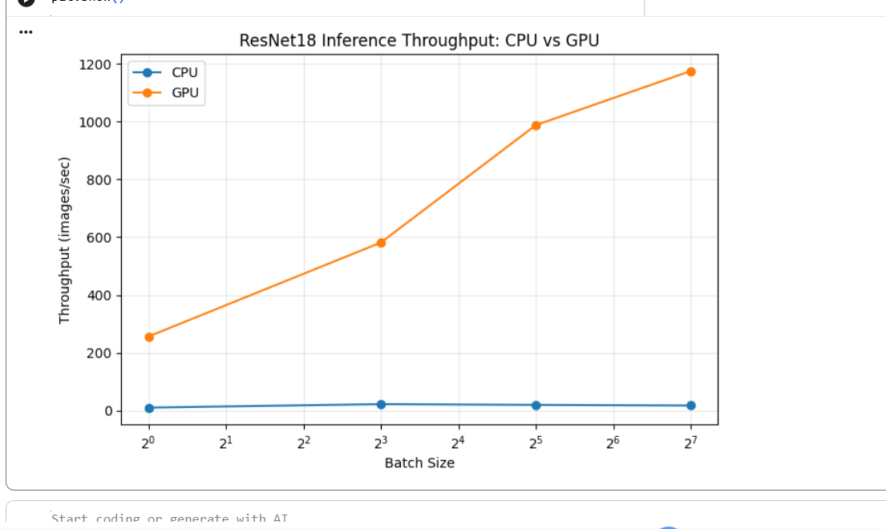

# CPU vs GPU Inference Benchmarking — Small Prototype

**Goal:** Measure how a model's inference latency and throughput change across batch sizes and hardware backends, as a first step toward using empirical profiling data to inform hardware/software configuration choices.

## Setup

- **Model:** ResNet18 (pretrained on ImageNet, `torchvision.models`), ~11.7M parameters
- **Input:** Random tensors shaped `[batch_size, 3, 224, 224]` (data content doesn't matter — only compute/memory behavior is measured)
- **Hardware:** Google Colab — CPU vs. Tesla T4 GPU
- **Batch sizes tested:** 1, 8, 32, 128

## Methodology

For each (device, batch size) pair:
1. Run one untimed warm-up inference pass (avoids counting one-time initialization overhead)
2. Run `n_runs=10` timed inference passes under `torch.no_grad()` (no gradient tracking, since this is inference-only)
3. On GPU, call `torch.cuda.synchronize()` before starting and stopping the timer — GPU operations are asynchronous, so without this the timer would stop before the GPU actually finishes work, giving falsely fast numbers
4. Average total time over the 10 runs, then compute throughput as `batch_size / avg_time`

## Results

| Batch Size | CPU avg time | CPU throughput | GPU avg time | GPU throughput |
|---|---|---|---|---|
| 1   | 0.0969s | 10.3 img/s | 0.0039s | 256.3 img/s |
| 8   | 0.3579s | 22.4 img/s | 0.0138s | 581.5 img/s |
| 32  | 1.6231s | 19.7 img/s | 0.0324s | 987.9 img/s |
| 128 | 7.3030s | 17.5 img/s | 0.1089s | 1175.1 img/s |

## Observations

On CPU, ResNet18 inference throughput stayed roughly flat (~17–22 images/sec) across batch sizes 1 to 128, suggesting the CPU isn't effectively parallelizing across the batch dimension. On GPU, throughput scaled substantially with batch size — from ~256 img/s at batch size 1 up to ~1175 img/s at batch size 128, a roughly 4.6x improvement just from increasing batch size, on top of a 24–67x speedup over CPU at the same batch size. This suggests that at small batch sizes, the GPU is underutilized — likely dominated by kernel launch and data-transfer overhead rather than compute — and only reaches its real advantage once the batch is large enough to keep it busy.

## Next Steps

- Profile *where* time goes at small batch sizes (e.g., `torch.profiler`) to confirm the overhead hypothesis
- Test whether the same pattern holds for other model architectures (e.g., transformer-based models)
- Extend to other hardware backends (NPUs, TPUs) as access allows
- Explore whether this kind of profiling data could feed an automated design-space search (e.g., an agentic system recommending hardware/batch configurations from measured behavior)
